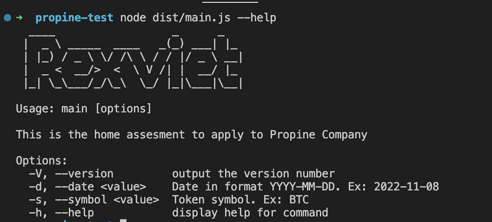

## Question 1 - Programming

_We're looking at your programming ability. It must not only work, it should be maintainable._

Let us assume you are a crypto investor. You have made transactions over a period of time which is logged in a [CSV file](https://s3-ap-southeast-1.amazonaws.com/static.propine.com/transactions.csv.zip). Write a command line program that does the following

- Given no parameters, return the latest portfolio value per token in USD
- Given a token, return the latest portfolio value for that token in USD
- Given a date, return the portfolio value per token in USD on that date
- Given a date and a token, return the portfolio value of that token in USD on that date

The CSV file has the following columns

- timestamp: Integer number of seconds since the Epoch
- transaction_type: Either a DEPOSIT or a WITHDRAWAL
- token: The token symbol
- amount: The amount transacted

Portfolio means the balance of the token where you need to add deposits and subtract withdrawals. You may obtain the exchange rates from [cryptocompare](https://min-api.cryptocompare.com/) where the API is free. You should write it in Node.js as our main stack is in Javascript/Typescript and we need to assess your proficiency.

## Solution

To read files in NodeJS, we all know that `fs` module is very helpful. With this module, we can use `readFile` or `createReadStream`.
While `readFile` load the whole file to memory before making it available, `createReadStream` reads the file by chunk. So in this case, with a large CSV file, `createReadStream` is the best solution to avoid memory dump.

I create a read stream to the csv file, and pipe to a CSV parse stream to read the file, parse into object, calculate the numbers, line by line.

Besides, with the help of `commander` module, I can easily pass the parameters to the program, with `-d` or `--date <value>` is the date value in format `YYYY-MM-DD`, and `-s` or `--symbol <value>` is the token symbol.

Morover, I have created `utils` dir, with several _static classes_:

- `CryptoCompareUtils`: is used to get pricing data from cryptocompare.com, with get latest price and get price in historical.
- `DateTimeUtils`: is used to convert the `date` parameter as string into epoc timestamp. On the end-user side, it's a bit inconvenient to pass in the exact epoc timestamp to the program, so I let the user pass the date as the readable format `YYYY-MM-DD`, and my program will convert it to epoc timestamp.
- `MoneyFormatUtils`: is used to format the output to the human familiar currency format.
